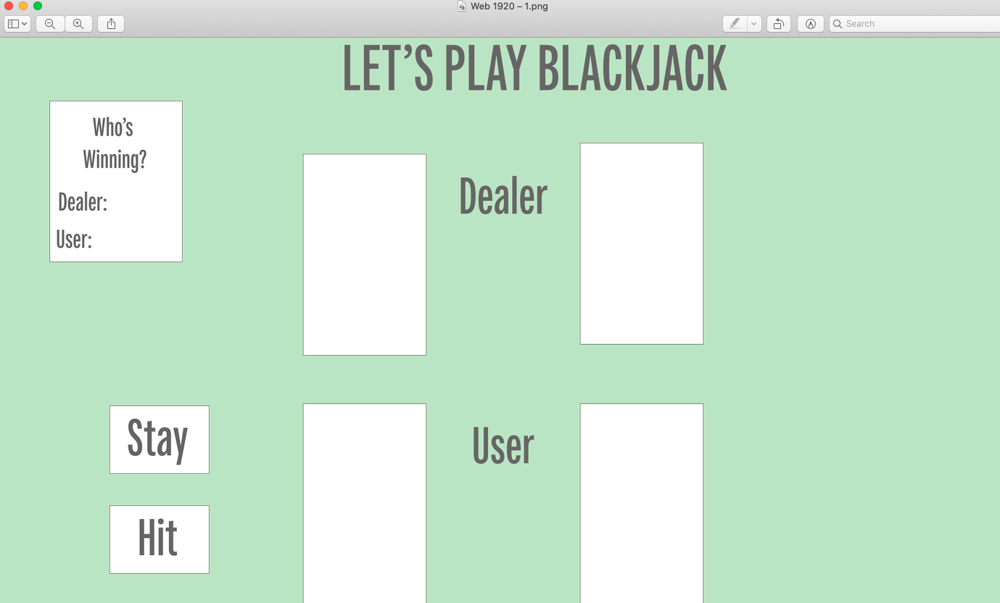
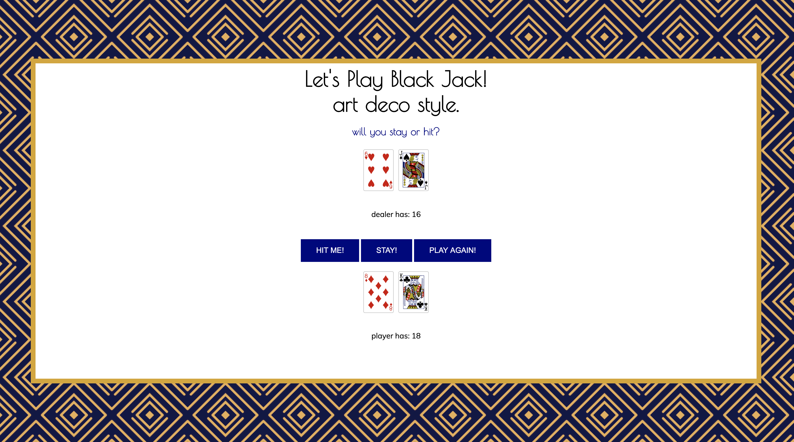

## **Black Jack, Art Deco Style**

## Screenshots 

#### Original Wireframe of Game 
I originally wanted to render the different parts of the game across the screen horizontally but had issues making the CSS grid work in the way I wanted it to. 

#### HTML and CSS Final Game Layout 
I switched to a Flexbox column layout and decided to display things vertically. 

## Technologies Used 
* HTML 
* CSS
* Javascript (vanilla)

## Link & Instructions 
- (https://mlisdev.github.io/js-blackjack-project/)
- On page load, the game will distribute and sum the 2 cards to you and the dealer. 
- Based on the scores, decide if you want to "hit" your hand or "stay." 
- Once you make your choice, the game will declare a winner. 
- _Remember_: in Black Jack you want to try and get to 21. The dealer will win if you =/= 21 and they land between 17 and 21. 

## Icebox Items 
- Render one of the dealer's cards upside down and with a secret value. 
- Improve upon CSS and HTML layout. 
- Include the ability to make bets on the hands before choosing hit or stay. 
- Make buttons invisible on render and have them show up only after hand dealt. 